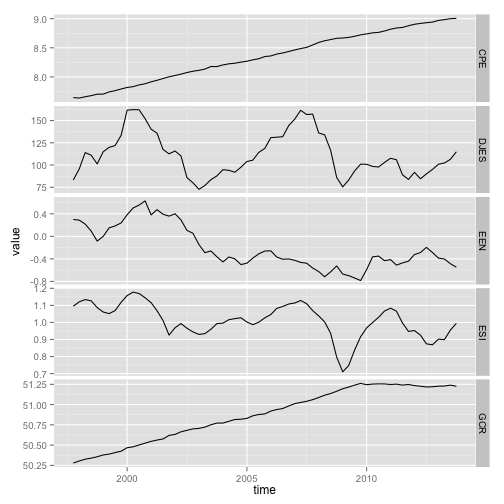
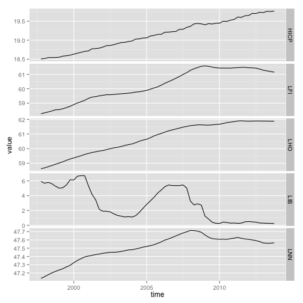
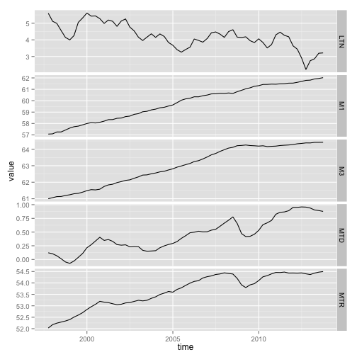
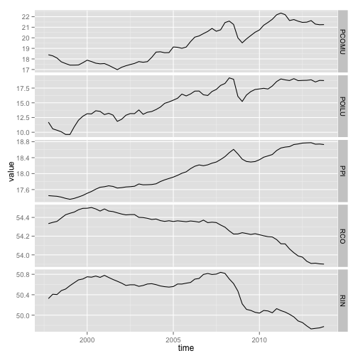
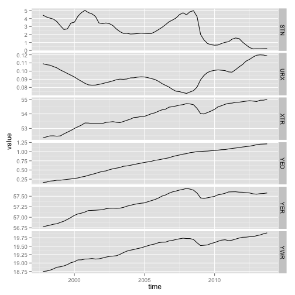
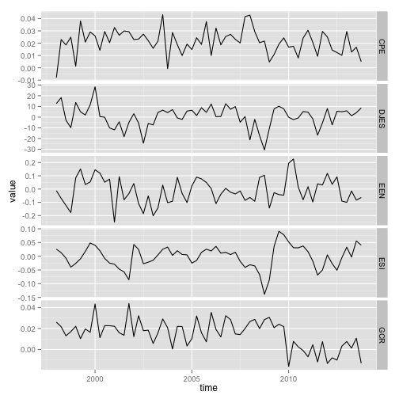
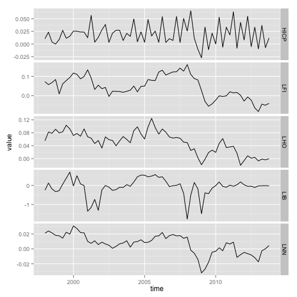
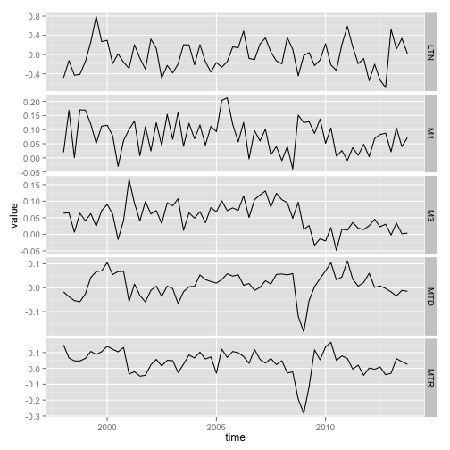
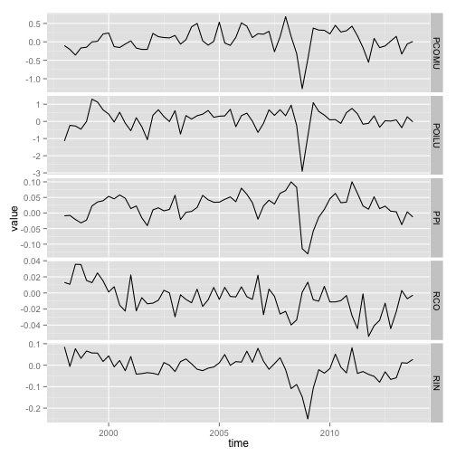
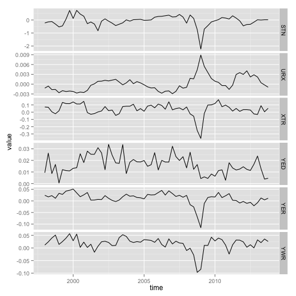

Stationnarity and choice of the lag number
========================================================

Package nécessaire :

```r
require(lassovar)
require(ggplot2)
require(reshape2)
require(urca)
```

Load the data and substract data from Q4 1997 :

```r
load("vardata.R")
subset<-subset(vardataframe[116:180,])
```


Il y a probablement beaucoup plus simple et rapide mais j'ai un peu galéré avec ggplot :

```r
var1<-subset[,1:5]
var2<-subset[,6:10]
var3<-subset[,11:15]
var4<-subset[,16:20]
var5<-subset[,21:26]

var1$time<-seq(as.Date("1997/10/01"), as.Date("2013/12/31"), by = "quarter")
var2$time<-seq(as.Date("1997/10/01"), as.Date("2013/12/31"), by = "quarter")
var3$time<-seq(as.Date("1997/10/01"), as.Date("2013/12/31"), by = "quarter")
var4$time<-seq(as.Date("1997/10/01"), as.Date("2013/12/31"), by = "quarter")
var5$time<-seq(as.Date("1997/10/01"), as.Date("2013/12/31"), by = "quarter")


mvar1 <- melt(var1,  id = 'time', variable.name = 'series')
mvar2 <- melt(var2,  id = 'time', variable.name = 'series')
mvar3 <- melt(var3,  id = 'time', variable.name = 'series')
mvar4 <- melt(var4,  id = 'time', variable.name = 'series')
mvar5 <- melt(var5,  id = 'time', variable.name = 'series')
```


```r
ggplot(mvar1, aes(time,value)) + geom_line() + facet_grid(series~ . ,scales="free")
```

 

```r
ggplot(mvar2, aes(time,value)) + geom_line() + facet_grid(series~ . ,scales="free")
```

 

```r
ggplot(mvar3, aes(time,value)) + geom_line() + facet_grid(series~ . ,scales="free")
```

 

```r
ggplot(mvar4, aes(time,value)) + geom_line() + facet_grid(series~ . ,scales="free")
```

 

```r
ggplot(mvar5, aes(time,value)) + geom_line() + facet_grid(series~ . ,scales="free")
```

 


Test de Racine unité ERS H0 : pas stationnaire. 

If "TRUE" : there is a unit root


```r
erstest<-function(data){
  result<-NULL
  for (i in seq(1,dim(data)[2],1)){
    ers<-ur.ers(data[,i], type = "P-test", model="trend", lag.max = 10)
    stat<-ers@teststat
    value5pc<-ers@cval[2]
    result[i]<-stat>value5pc
  }
  return(rbind(names(data),result))
}


dfglstest<-function(data){
  result<-NULL
  for (i in seq(1,dim(data)[2],1)){
    ers<-ur.ers(data[,i], type = "DF-GLS", model="trend", lag.max = 2)
    stat<-ers@teststat
    value5pc<-ers@cval[2]
    result[i]<-stat>value5pc
  }
  return(rbind(names(data),result))
}
```

Results: 


```r
erstest(subset)
```

```
##        [,1]   [,2]    [,3]   [,4]    [,5]   [,6]   [,7]   [,8]   [,9]  
##        "CPE"  "DJES"  "EEN"  "ESI"   "GCR"  "HICP" "LFI"  "LHO"  "LIB" 
## result "TRUE" "FALSE" "TRUE" "FALSE" "TRUE" "TRUE" "TRUE" "TRUE" "TRUE"
##        [,10]  [,11]   [,12]  [,13]  [,14]   [,15]  [,16]   [,17]   [,18]  
##        "LNN"  "LTN"   "M1"   "M3"   "MTD"   "MTR"  "PCOMU" "POILU" "PPI"  
## result "TRUE" "FALSE" "TRUE" "TRUE" "FALSE" "TRUE" "TRUE"  "TRUE"  "FALSE"
##        [,19]  [,20]  [,21]   [,22]  [,23]  [,24]  [,25]  [,26] 
##        "RCO"  "RIN"  "STN"   "URX"  "XTR"  "YED"  "YER"  "YWR" 
## result "TRUE" "TRUE" "FALSE" "TRUE" "TRUE" "TRUE" "TRUE" "TRUE"
```

```r
dfglstest(subset)
```

```
##        [,1]   [,2]   [,3]   [,4]    [,5]   [,6]   [,7]   [,8]   [,9]  
##        "CPE"  "DJES" "EEN"  "ESI"   "GCR"  "HICP" "LFI"  "LHO"  "LIB" 
## result "TRUE" "TRUE" "TRUE" "FALSE" "TRUE" "TRUE" "TRUE" "TRUE" "TRUE"
##        [,10]  [,11]   [,12]  [,13]  [,14]   [,15]  [,16]   [,17]   [,18] 
##        "LNN"  "LTN"   "M1"   "M3"   "MTD"   "MTR"  "PCOMU" "POILU" "PPI" 
## result "TRUE" "FALSE" "TRUE" "TRUE" "FALSE" "TRUE" "TRUE"  "TRUE"  "TRUE"
##        [,19]  [,20]  [,21]  [,22]  [,23]  [,24]  [,25]  [,26] 
##        "RCO"  "RIN"  "STN"  "URX"  "XTR"  "YED"  "YER"  "YWR" 
## result "TRUE" "TRUE" "TRUE" "TRUE" "TRUE" "TRUE" "TRUE" "TRUE"
```


Il a donc des racines unitaire presque pour toutes les variables :

First difference of all series :

```r
FDall<-function(data){
dif<-matrix(0,nrow=dim(data)[1]-1,ncol=dim(data)[2])
for (i in seq(1,dim(data)[2],1)){
  dif[,i]<-diff(data[,i],lag=1)
  colnames(dif)<-names(data)
}
return(dif)
}
```


First difference of non stationary series only

```r
FDnonstationary<-function(data){
  dif<-matrix(0,nrow=dim(data)[1]-1,ncol=dim(data)[2])
  for (i in seq(1,dim(data)[2],1)){
    if (dfglstest(data)[2,i]==TRUE) {
      dif[,i]<-diff(data[,i],lag=1)
    }
    else {
      dif[,i]<-data[2:dim(data)[1],i]
    }
    colnames(dif)<-names(data)
  }
  return(dif)
}
```


Je différencie l'ensemble des variables:

```r
dsubset<-FDall(subset)
dsubset<-data.frame(dsubset)
```

Je plot les FD : 


```r
var1<-dsubset[,1:5]
var2<-dsubset[,6:10]
var3<-dsubset[,11:15]
var4<-dsubset[,16:20]
var5<-dsubset[,21:26]

var1$time<-seq(as.Date("1998/01/01"), as.Date("2013/12/31"), by = "quarter")
var2$time<-seq(as.Date("1998/01/01"), as.Date("2013/12/31"), by = "quarter")
var3$time<-seq(as.Date("1998/01/01"), as.Date("2013/12/31"), by = "quarter")
var4$time<-seq(as.Date("1998/01/01"), as.Date("2013/12/31"), by = "quarter")
var5$time<-seq(as.Date("1998/01/01"), as.Date("2013/12/31"), by = "quarter")

mvar1 <- melt(var1,  id = 'time', variable.name = 'series')
mvar2 <- melt(var2,  id = 'time', variable.name = 'series')
mvar3 <- melt(var3,  id = 'time', variable.name = 'series')
mvar4 <- melt(var4,  id = 'time', variable.name = 'series')
mvar5 <- melt(var5,  id = 'time', variable.name = 'series')

ggplot(mvar1, aes(time,value)) + geom_line() + facet_grid(series ~ . ,scales="free")
```

 

```r
ggplot(mvar2, aes(time,value)) + geom_line() + facet_grid(series ~ . ,scales="free")
```

 

```r
ggplot(mvar3, aes(time,value)) + geom_line() + facet_grid(series ~ . ,scales="free")
```

 

```r
ggplot(mvar4, aes(time,value)) + geom_line() + facet_grid(series ~ . ,scales="free")
```

 

```r
ggplot(mvar5, aes(time,value)) + geom_line() + facet_grid(series ~ . ,scales="free")
```

 

Il y a de la saisonnalité ! Probablement que les test ne sont pas top.. 
Peut être faudrait il faire une analyse plus fine des séries : SARIMA ? 


On peut faire des tets de stationnarité sur les DF, cette fois sans composante TREND qui a été supprimée, mais uniquement avec une constante :


```r
dfglstest2<-function(data){
  result<-NULL
  for (i in seq(1,dim(data)[2],1)){
    ers<-ur.ers(data[,i], type = "DF-GLS", model="constant", lag.max = 8)
    stat<-ers@teststat
    value5pc<-ers@cval[2]
    result[i]<-stat>value5pc
  }
  return(rbind(names(data),result))
}


erstest2<-function(data){
  result<-NULL
  for (i in seq(1,dim(data)[2],1)){
    ers<-ur.ers(data[,i], type = "P-test", model="constant", lag.max = 8)
    stat<-ers@teststat
    value5pc<-ers@cval[2]
    result[i]<-stat>value5pc
  }
  return(rbind(names(data),result))
}
```


Choix du nombre de lag :

```r
lagchoice<-function(data,lagmax){
  AIC<-NULL
  HQ<-NULL
  SC<-NULL
  for (i in seq(1,lagmax,1)){
    lv<-lassovar(data, lags=i)
    cons<-lv$coefficients[1,]
    coef<-lv$coefficients[-1,]
    res<-lv$y-matrix(rep(1,dim(lv$y)[1]))%*%t(cons)-lv$x%*%coef
    Sigma<-((dim(lv$y)[1])^-1)*(t(as.matrix(res))%*%as.matrix(res))
    det<-det(Sigma)
    AIC[i]<-log(det)+2*i*dim(data)[2]^2/dim(subset)[1]
    HQ[i]<-log(det)+2*log(log(dim(data)[1]))*i*dim(data)[2]^2/dim(data)[1]
    SC[i]<-log(det)+log(dim(data)[1])*i*dim(data)[2]^2/dim(data)[1]
  }
  return(rbind(AIC,HQ,SC))
}
```

Pour prendre en compte une composante TREND dans le var : 

```r
trend<-data.frame(seq(1,dim(subset)[1],1))
```


Results :


```r
lassovar(subset,lags=4, ic="AIC", ex=trend)
```

Marche alors que : 


```r
lassovar(subset,lags=4, ic="AIC", exo=trend)
```

```
## Error in hasTsp(x): paramètres de série temporelle fournis incorrects
```

Ne marche pas ...!??


```r
lagchoice(subset,lagmax=10)
```

```
##          [,1]      [,2]      [,3]      [,4]      [,5]       [,6]
## AIC -313.4776 -293.5079 -272.0515 -252.3023 -232.7070 -213.20742
## HQ  -304.5550 -275.6629 -245.2839 -216.6122 -188.0944 -159.67227
## SC  -290.8639 -248.2807 -204.2106 -161.8478 -119.6389  -77.52566
##           [,7]        [,8]       [,9]      [,10]
## AIC -193.37988 -173.418733 -153.79460 -133.86697
## HQ  -130.92220 -102.038527  -73.49186  -44.64171
## SC   -35.08449    7.490288   49.72805   92.26931
```


On choisit 1 seul lag à partir des trois critères (probablement car les séries ont une racine unitaire)


```r
lagchoice(dsubset,10)
```

```
##          [,1]      [,2]      [,3]      [,4]      [,5]       [,6]
## AIC -340.6379 -319.9961 -297.0640 -276.5553 -256.2839 -235.84207
## HQ  -331.3296 -301.3795 -269.1390 -239.3219 -209.7423 -179.99207
## SC  -317.5097 -273.7397 -227.6793 -184.0424 -140.6429  -97.07285
##           [,7]        [,8]       [,9]      [,10]
## AIC -215.29525 -194.452689 -174.05567 -153.33873
## HQ  -150.13691 -119.986022  -90.28067  -60.25540
## SC   -53.39783   -9.427068   34.09816   77.94329
```

